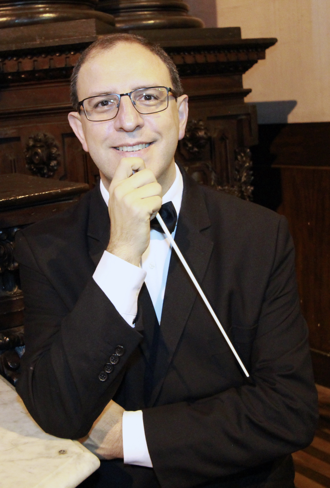
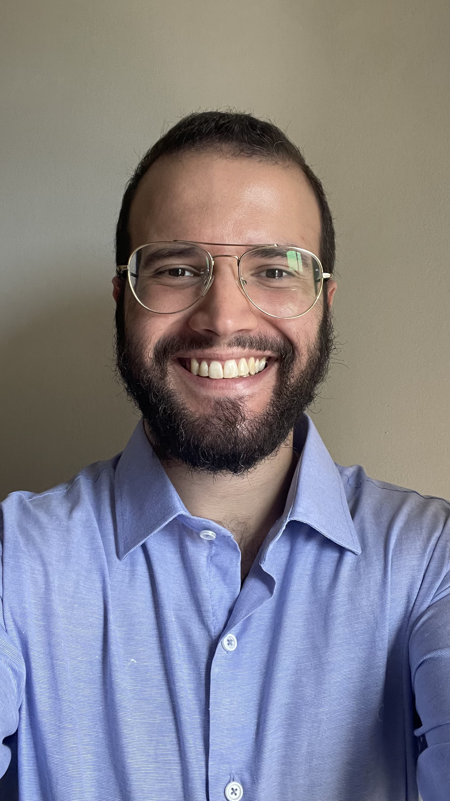
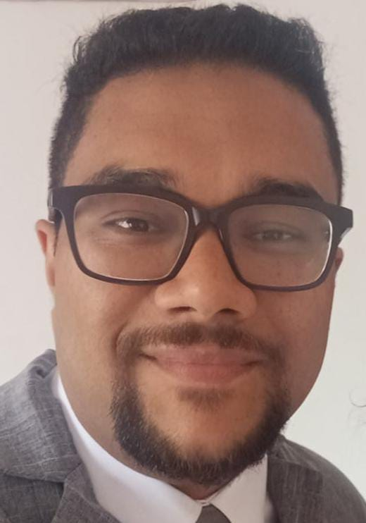
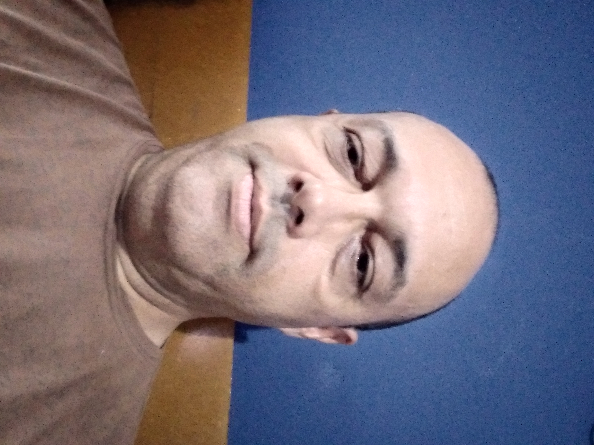
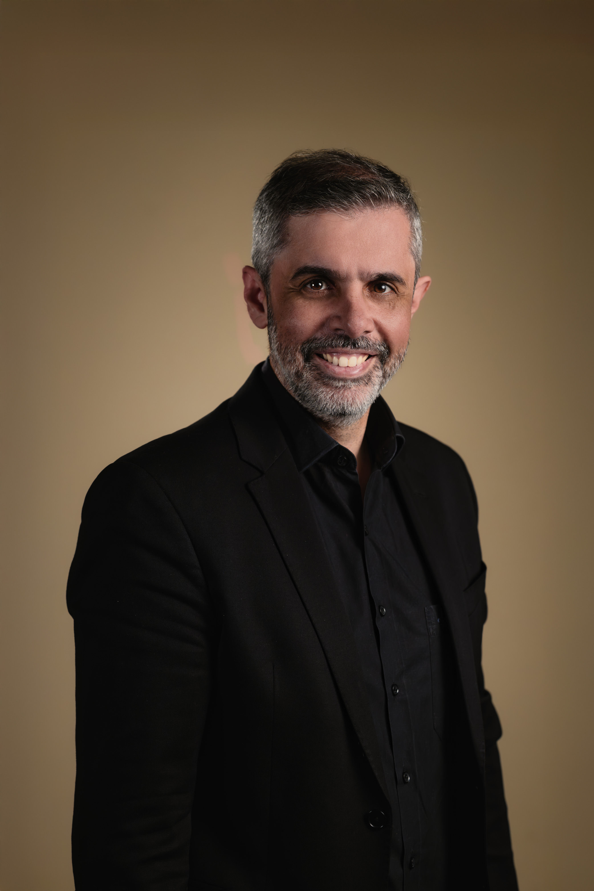

# Equipe
## Membros do Conselho Diretivo

---

### Diretoria

#### Presidente: Prof. Dr. Clayton Júnior Dias

Clayton Júnior Dias é Doutor em Música pela Universidade Estadual de Campinas (Unicamp). É Mestre em Música e Bacharel em Música com habilitação em Voz pela mesma instituição, além de graduado em Filosofia. Em 2023, concluiu seu primeiro estágio de pós-doutorado como pesquisador colaborador no Departamento de História do Instituto de Filosofia e Ciências Humanas da Unicamp. Atualmente, realiza o segundo estágio de pós-doutorado na mesma instituição, onde atua como docente responsável pelas disciplinas de História e Linguagens Musicais da Antiguidade Tardia ao Final da Idade Média, Introdução à Paleografia Latina Medieval e Codicologia. Como especialista em Canto Gregoriano, frequentou o curso trienal fundamental e o curso bienal superior de Canto Gregoriano no Centro Francescano Studi di Canto Gregoriano, em Assis. Participou ainda de cursos monográficos promovidos pela Associazione Internazionale Studi di Canto Gregoriano e pelo Pontificio Istituto di Musica Sacra. Também realizou cursos de especialização em Manuscritos Litúrgicos Medievais (USP, Harvard University, Sorbonne Université, Asociación Egeria de Madrid) e Regência Polifônica e Gregoriana (Pontificio Istituto di Musica Sacra). De 2012 a 2024 realizou estágio de pesquisa no Archivum Secretum Vaticanum. De 2021 e 2024, cursou o Master of Advanced Studies (MAS) em Canto Gregoriano, Paleografia e Semiologia pela Scuola Universitaria di Musica della Svizzera Italiana, em Lugano, Suíça, defendendo sua tese em 2024 com a distinção Summa cum laude. Ao longo de sua formação como gregorianista esteve sob a orientação de Alberto Turco, Alessandro de Lillo, Angelo Rusconi, Claudio Accorsi, Franz Karl Praẞl, Fulvio Rampi, Giacomo Baroffio, Gionata Brusa, Giovanni Conti, Johannes Berchmanz Göschl, Marco Gozzi, Pe. Matteo Ferraldeschi, Pe. Maurizio Verde, e Daniel Saulnier. É membro da Associazione Internazionale Studi di Canto Gregoriano (AISCGre) e participa de grupos de pesquisa dedicados à catalogação e indexação de manuscritos medievais. Além disso, integra o Laboratório de Estudos Medievais da USP-Unicamp e do Centro de Estudos sobre Diversidade Antiga, Pré-história, Antiguidade e Idade Média da Unicamp. Atualmente, é diretor e professor do Centro de Estudos de Música Sacra e Liturgia da Arquidiocese de Campinas (CEMULC) e leciona Canto Gregoriano no curso de pós-graduação em Música Litúrgica do INSECH – Instituto de Educação, Cultura e Humanidades e no curso de pós-graduação em Música Litúrgica da FASBAM. Desempenha a função de mestre-de-capela da Catedral Metropolitana de Campinas e é diretor artístico e regente do Coro da Arquidiocese de Campinas, do Coro Dom Bruno Gamberini da Paróquia São Paulo Apóstolo, do Coro Tutti Cantanti, no Distrito de Sousas e do Coral Cantate Domino da Paróquia Santa Isabel. É autor de livros sobre Canto Gregoriano, incluindo “Canto Gregoriano: Teoria e Prática na Liturgia” (Editora Ecclesiae) e “Missal Romano: Cantos dos Ministros e da Assembleia” (Edições CNBB). Com o Coro da Arquidiocese de Campinas gravou diversos CDs de música litúrgica pela Paulinas COMEP e Edições CNBB. É membro da Comissão Episcopal Pastoral para a Liturgia da CNBB (Regional Sul 1) e atua como perito responsável pela música na tradução portuguesa da terceira edição típica do Missal Romano para o Brasil, realizada e publicada pela CNBB.

#### Vice-presidente: Pe. Breno Cury Alheiro da Silva

Sacerdote Católico da Arquidiocese de Niterói/RJ, cursou Filosofia e Teologia no Instituto Filosófico e Teológico do Seminário São José, da mesma Arquidiocese. Fez cursos livres de teoria musical, tendo experiência em prática musical de coro no Seminário São José de Niterói. É aluno de Introdução ao Canto Gregoriano, Semiologia Gregoriana, Paleografia Gregoriana, Estética Gregoriana e Musicologia Litúrgica pelo CEMULC, sob a docência do Prof. Dr. Clayton Dias. Participou de todas as edições do Laudis Canticum - Curso Internacional de Canto Gregoriano em Campinas/São Paulo. É autor do livro “A teologia do canto gregoriano”, publicado pela Editora Benedictus, prefaciado pelo Prof. Dr. Clayton Dias.

#### 1º Secretário: Diego da Silva Lima

Mestre-de-capela da Catedral de Maceió/AL e Diretor do Coro da Arquidiocese de Maceió. Professor de Música Sacra no Seminário N. Sra. da Assunção (Arquidiocese de Maceió) e no Seminário S. João Maria Vianney (Diocese de Palmeira dos Índios). Aluno de Canto Gregoriano, Regência, Musicologia, Semiologia Gregoriana e Paleografia Gregoriana no CEMULC (Prof. Dr. Clayton Dias). Participou da equipe de editoração do livro “Missal Romano: Cantos do Missal em Notação Vaticana”, publicado pela CNBB sob a coordenação do Prof. Dr. Clayton Dias. É Engenheiro Civil, Mestre em Recursos Hídricos (Universidade Federal de Alagoas) e Doutorando em Recursos Hídricos (Universidade de Brasília e University of Texas at San Antonio - EUA). Escritor, Membro Efetivo da Academia Maceioense de Letras, cadeira nº 10, e Técnico do Instituto Federal de Alagoas, Campus Maceió.

#### 2º Secretário: Willian Lovato

Bacharel em Música pela Universidade Federal do Rio Grande do Sul, com curso de extensão em Produção Musical pela Pontifícia Universidade Católica do Rio Grande do Sul. Possui formação em Canto Gregoriano, Interpretação, Semiologia e Modalidade, Paleografia Gregoriana, Estética Gregoriana, Musicologia Litúrgica e Legislação Litúrgico-Musical pelo CEMULC (Prof. Dr. Clayton Dias) e participou dos Cursos de Musicologia litúrgica promovidos pela Edições CNBB (Prof. Dr. Clayton Dias). É regente do Coro Santa Hildegarda, na Igreja Matriz Bom Jesus da Coluna em Xanxerê (RS), Arquidiocese de Chapecó. É professor de Canto Gregoriano para os alunos do Colégio La Salle Agrícola de Xanxerê. Atualmente, é aluno de pós-graduação em Musicoterapia pela FAMEF.

#### 1º Tesoureiro: Pe. Filipe

Sacerdote católico da Diocese do Crato/CE. Possui graduação em Filosofia pelo Instituto Diocesano de Filosofia e Teologia (Seminário São José do Crato), graduação em Teologia pelo Centro Universitário Católica de Quixadá, Pós-graduação em Música Litúrgica pelo Centro Universitário Salesiano de São Paulo (UNISAL). É aluno do Mestrado em Direito Canônico do Instituto de Direito Canônico Santa Catarina (Arquidiocese de Florianópolis), agregado à Pontifícia Universidade Lateranense. É aluno de Paleografia Gregoriana, Estética Gregoriana e Musicologia Litúrgica pelo CEMULC (Prof. Dr. Clayton Dias). Participou de todas as edições do Laudis Canticum, curso presencial de canto gregoriano em Campinas (Prof. Dr. Clayton Dias). É membro do Conselho de Formação do Seminário São José (Diocese de Crato), assumindo as funções de Ecônomo e Diretor de Estudos, além de coordenar os cursos de Filosofia e de Teologia do Instituto Diocesano de Filosofia do Crato. É membro da Comissão Diocesana de Liturgia do Crato, coordenando o Setor de Música Litúrgica. Atua na regência de coros. É juiz auditor da Câmara Eclesiástica do Crato.

#### 2º Tesoureiro: Lucas Siduoski

Bacharel em Piano pela Universidade Federal de Santa Maria e estudante de órgão de tubos. Maestro do Coro da Basílica Nossa Senhora Medianeira de todas as Graças em Santa Maria/RS. Cantor e organista da Catedral Metropolitana Imaculada Conceição, na mesma cidade. Professor de música e maestro do Coral Infantil da Escola Mater Educatrix, que trabalha exclusivamente com o repertório de Canto Gregoriano e Música Sacra. Trabalha como professor de música sacra em cursos de órgão e canto para crianças, jovens e adultos. Aluno do Prof. Dr. Clayton Dias nos cursos de Introdução ao Canto Gregoriano, Interpretação, Semiologia e Modalidade, Salmodia Gregoriana. Empresário, sócio proprietário e administrador da Mediatrix - Escola de Música Sacra.

---

### Conselho Fiscal

#### Edwin Aldrin Corrêa Lima

Atua na área de consultoria e administração, assessorando empresas nas áreas fiscal, contábil e financeira no contexto de projetos de inovação tecnológica. Possui graduação em Gestão de Recursos Humanos. É fundador do Inovame, instituição sem fins lucrativos voltada à pesquisa, desenvolvimento e inovação, exercendo as funções de vice-presidente e diretor administrativo. Na área musical, atua há 15 anos como cantor-regente em coros gregorianos, sempre interpretando integralmente o repertório contido no Graduale Romanum. Estudou canto gregoriano em cursos do Centro de Estudos de Música Sacra e Liturgia da Arquidiocese de Campinas (CEMULC) com o Prof. Dr. Clayton Dias, cursando as disciplinas de Semiologia, Paleografia, Interpretação, Modalidade, Regência e Estética. Apresentou o seminário “Uma análise acerca da aplicação prática do método de interpretação do repertório gregoriano segundo os princípios de Solesmes” durante o Laudis Canticum edição 2025.

#### Laércio Benedito Sivali de Sousa

Cantor e harmonista do Santuário Diocesano S. José de Salesópolis, diocese de Mogi das Cruzes/SP, desde 1998. Possui ampla experiência em editoração digital de partituras gregorianas, incluindo projetos para analisadores sintáticos e semânticos para códigos em notação GABC, fornecendo funcionalidades como realce de sintaxe, correção de erros, autocompletamento de código etc. Atualmente está à frente de um projeto de adaptação do repertório do Graduale Simplex para língua portuguesa sob a supervisão do Prof. Dr. Clayton Dias. Ministrou formações promovidas pela Faculdade Paulo VI sobre a História do Canto Gregoriano e sobre a estrutura textual dos Salmos do Lecionário/Liturgia das Horas conforme texto oficial da CNBB. É aluno do Prof. Dr. Clayton Dias, tendo cursado as disciplinas de Canto Gregoriano, Semiologia Gregoriana, Paleografia Gregoriana, Missal Romano: cantos dos ministros e da assembleia, Missal Romano: Estudos sobre os Cantos da Missa. É Técnico Judiciário no Tribunal Regional Federal da 3ª Região, na equipe de Segurança Cibernética. Dentre outras atribuições, é responsável pela fiscalização de contratos.

#### Nivaldo Aparecido de Souza Júnior

Professor de Música Sacra no Colégio São José da Divina Providencia em Osasco/São Paulo. Aluno do CEMULC (Prof. Dr. Clayton Dias) nos cursos de: Introdução ao Canto Gregoriano; Canto Gregoriano: Interpretação, Semiologia e Modalidade; Estética Gregoriana; História da Música Sacra; Iniciação à Regência Coral; Fundamentos Teóricos da Técnica vocal para o Canto Coral. Participou da equipe de editoração do livro “Missal Romano: Cantos do Missal em Notação Vaticana”, sob a supervisão do Prof. Dr. Clayton Dias. Cursos realizados: Missal Romano: cantos dos ministros e da assembleia; Missal Romano: Estudos sobre os Cantos da Missa; A rítmica de Dalcroze: uma educação por e para a música (Instituto de Artes da Universidade Estadual de Campinas); Pós-Graduação Latu Sensu: Educação Musical (FACCAMP).

---

### Conselho Consultivo

#### Giovanni Conti

Discípulo do célebre gregorianista suíço Luigi Agustoni, Giovanni Conti deu continuidade à sua orientação ancorada nas intuições do francês Eugène Cardine por meio de múltiplas atividades. É diretor do Master of Advanced Studies (MAS) em Paleografia e Semiologia Gregoriana na Escola Universitária de Música da Suíça Italiana, em Lugano, e professor de Musicologia Litúrgica na Faculdade Teológica de Lugano e na Universidade de Parma (curso de Mestrado em Musicologia). Ministra diversos cursos, entre os quais se destacam aqueles promovidos em Cremona e em Arco di Trento pela Associação Internacional de Estudos de Canto Gregoriano; em Rougemont (Gstaad) pela Schola Cantorum Basiliensis; em Valle de los Caídos (Escorial – Madri) pela AHIESGRE; em Assis – Santa Maria dos Anjos pelo Centro Franciscano de Canto Gregoriano; em Catânia, no Centro Universitário San Nicola l’Arena; e em Milão, na Escola Cívica de Música Claudio Abbado. Conduz pesquisas e ministra seminários universitários em diversos centros europeus sobre as formas de canto sacro ocidental, sobre fontes litúrgicas medievais e sobre o repertório sacro latino das culturas musicais da Europa, bem como suas transformações ao longo da Idade Média, Renascimento e Barroco. Desenvolve atividade de crítica musical e publicou numerosos artigos e ensaios em periódicos e revistas especializadas. É membro de júris em prestigiados concursos internacionais. Tem em seu currículo diversas produções musicais para rádio e televisão: para a televisão austríaca ORF, para a TV e Rádio Suíça, para a RAI – Radiotelevisão Italiana, para a Polska TV, para a Nippon Television, para a ZDF e para o Centro Televisivo Vaticano. Atua internacionalmente em concertos à frente dos ensembles vocais More Antiquo (masculino) e Adiástema (feminino). Gravou para selos como JVC, Ares, Naxos, Paoline Audiovisivi, Chgc, Amadeus, Classic Voice, ARTS e Dynamic. É diretor artístico da Mostra Internacional de Música Medieval e Renascentista Cantar di Pietre. É presidente da seção italófona da Associação Internacional de Estudos de Canto Gregoriano e vice-presidente do conselho diretivo internacional da mesma entidade. Diretor da revista internacional Vox Antiqua, é membro do conselho diretivo da Réseau Européen de Musique Ancienne junto ao Ministério da Cultura da França. Sucedeu Luigi Agustoni na direção de Cantus Gregoriani Helvetici Cultores. Já responsável pelas atividades do Coro da Radiotelevisão Suíça, atualmente é responsável pela produção musical clássica da mesma instituição.

#### André Gaby

Doutor em Musicologia Histórica pela Universidade Estadual Paulista (UNESP) e Mestre em Canto Gregoriano pelo Conservatório de Turim (Itália), sob orientação de Fulvio Rampi. Atualmente é docente da Escola de Música da Universidade Federal do Pará, onde leciona disciplinas como Teoria Musical, Percepção Musical, Harmonia e História da Música. Atua também como pianista acompanhador, organista, corista, regente coral, gregorianista, arranjador, compositor, palestrante e pesquisador. Desenvolve um projeto de pesquisa e extensão sobre o uso do canto gregoriano na musicalização infantil, com base no Método Ward, tendo como polos de investigação a Escola de Música da UFPA e a Academia Principia. Participou de cursos com gregorianistas como Juan Carlos Asensio e Alberto Turco. Em 2015, foi bolsista do Programa Santander Jovens Pesquisadores, realizando estudos em Madri sob orientação do pesquisador e gregorianista Ismael Fernández de la Cuesta. Também realizou estágio doutoral na Universidade Nova de Lisboa, sob orientação do musicólogo Manuel Pedro Ferreira. Participou da equipe de editoração do livro “Missal Romano: Cantos do Missal em Notação Vaticana”, sob a supervisão do Prof. Dr. Clayton Dias. Além da pesquisa acadêmica, atua como regente e diretor de grupos dedicados à música sacra, como a Schola Gregoriana Ad te levavi e o coro feminino Vox Cordis Mariae, promovendo o diálogo entre a prática litúrgica e a reflexão estética da música antiga.

#### Antonio Carlos Silvano Pessotti

Possui graduação em Música pela Universidade Estadual de Campinas (2003), mestrado em Linguística pela Universidade Estadual de Campinas (2007) e Doutorado em Linguística pela Universidade Estadual de Campinas (2012). Estudou Canto Gregoriano, Semiologia Gregoriana e Paleografia Gregoriana no Centro de Estudos de Música Sacra e Liturgia da Arquidiocese de Campinas (Prof. Dr. Clayton Dias). É professor de canto e regente da Schola Cantorum São Miguel Arcanjo. Tem experiência na área de Artes, com ênfase em Música, atuando principalmente nos seguintes temas: fonética, música, música, cognição, musico linguística, teoria dinâmica da fala e fonologia gestual.

#### Daniela Ayres

Cantora e organista, é bacharel em Música com habilitação em Canto Lírico pela Universidade Federal do Rio Grande do Sul (UFRGS). É aluna do Prof. Dr. Clayton Dias nas disciplinas de Estética Gregoriana, Semiologia Gregoriana, Musicologia Litúrgica, Canto Gregoriano: Interpretação, Semiologia e Modalidade, Paleografia Gregoriana. Atua como cantora e organista em Porto Alegre, na Basílica Menor Nossa Senhora das Dores, Santuário São Rafael, Paróquia Nossa Senhora de Belém e Nossa Senhora Auxiliadora.

#### Fernando Sávio da Conceição Cury

É doutor em Performance/Guitarra clássica pela Universidade de Aveiro (Portugal) e mestre em Práticas Interpretativas em Violão pela Universidade Federal do Rio de Janeiro. Apresentou-se como solista em vários países da América do Sul e da Europa. Foi professor substituto da UFRJ e Escola Pedro Pedro II, professor de guitarra clássica (violão) na Academia de Artes de Chaves (Portugal), professor na formação em violão de alunos em intercâmbio na Universidade de Aveiro. Foi, por 14 anos, organista e regente do coral da igreja Nossa Senhora da Paz em Ipanema/Rio de Janeiro e atualmente é regente do Coral Arquidiocesano de Niterói/Rio de Janeiro. Concluiu os cursos de iniciação ao Canto Gregoriano e Semiologia Gregoriana. Atualmente, frequenta os cursos de Paleografia Gregoriana e Estética Gregoriana pelo CEMULC, ministrados pelo Prof. Clayton Dias. Participou da equipe de editoração do Livro (Missal Romano: Cantos do Missal em Notação Vaticana), publicado pela CNBB sob a coordenação do Prof. Dr. Clayton Dias. Além disso, participou das edições do Laudis Canticum - Curso Internacional de Canto Gregoriano em Campinas/São Paulo.

#### Pedro Estevão Quental

Cravista e organista, tem como foco a pesquisa e interpretação do repertório tecladístico do Barroco e Renascimento. Graduado em música pela Universidade Estadual de Campinas, estudou com o Prof. Dr. Edmundo Hora. Possui Bacharelado e Mestrado em Órgão em Música Sacra em Regensburg sob orientação do Dr. Christoph Hönerlage. Atualmente é organista titular do Mosteiro de São Bento em Vinhedo/São Paulo.

#### Felipe Antônio Bernardo

É Bacharel em Piano pela Faculdade Santa Marcelina e Mestre em Performance Musical Órgão pela Universidade Estadual Paulista. Desde 2008 é Mestre de Capela e Organista Titular no Pateo do Collegio. Possui especialização em Canto Gregoriano no Centro Francescano Studi di Canto Gregoriano em Assis, na Itália. Colabora como organista e continuísta com importantes coros e orquestras, com destaque para a Orquestra Sinfônica do Estado de São Paulo e seu Coro, Coral Paulistano do Theatro Municipal de São Paulo e a Orquestra Sinfônica Municipal, Coro Luther King e Camerata Sé. É Organista Associado no Mosteiro de São Bento desde 2012. Desde 2021 é Pianista Correpetidor e Professor de Piano e Órgão na Escola Municipal de Música e Regente Associado do Coro Luther King.

#### Danilo Martins Ferreira

Mestre em Musicologia pela Universidade Estadual de São Paulo (USP), onde obteve bacharelado em música, com habilitação em piano sob a orientação do Prof. José Eduardo Martins. É mestre-de-capela da Paróquia Nossa Senhora do Brasil e diretor artístico do Coral Del Chiaro. Estudou regência na Universidade Estadual de São Paulo. Fez cursos de especialização pela UNIBAN, ULM, Sociedade Kodály e USP nas áreas de Piano e Regência. Aluno de Canto Gregoriano, Regência, Musicologia, Semiologia Gregoriana e Paleografia Musical no CEMULC (Prof. Dr. Clayton Dias). Participou da equipe de editoração do Livro (Missal Romano: Cantos do Missal em Notação Vaticana), publicado pela CNBB sob a coordenação do Prof. Dr. Clayton Dias.

